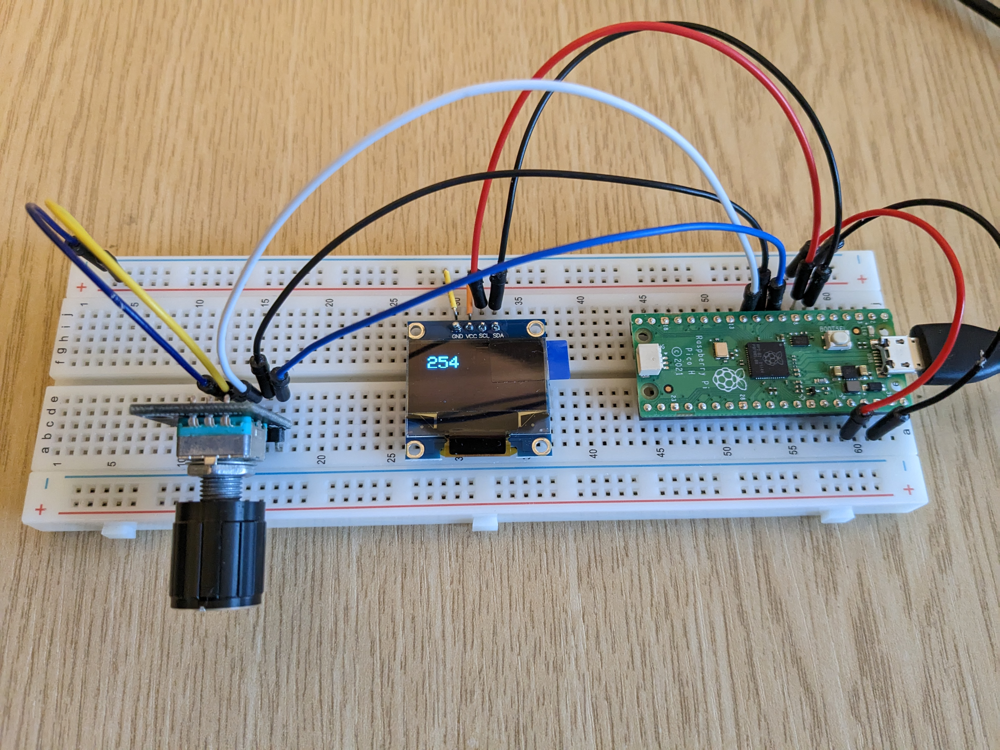

# pico_oled_rotary

This is an example project which shows how to connect an
OLED screen and rotary encoder to a Raspberry Pi Pico. It
mostly uses code I found scattered around the internet.

The screen is 0.96" OLED with a SSD1306 driver chip.
That's driven by I2C.

The rotary encoder is a generic one, driven by 3 GPIOs.

It looks like this:

Turn the knob one way, the number goes up. Turn it the other
way, the number goes down. Click the knob in and the number
resets.

It's not rocket science but it took me a day to find
all the details and get the example working, so it might
save someone else that effort.

Derek Fountain, April 2023
